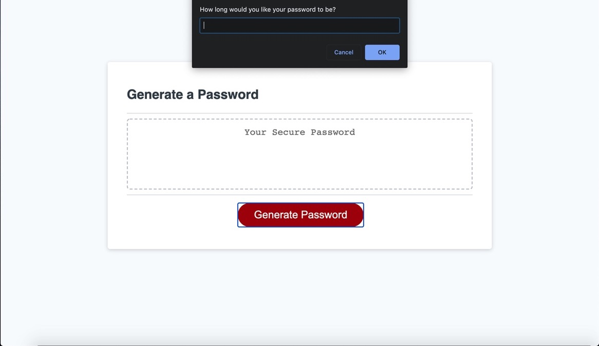
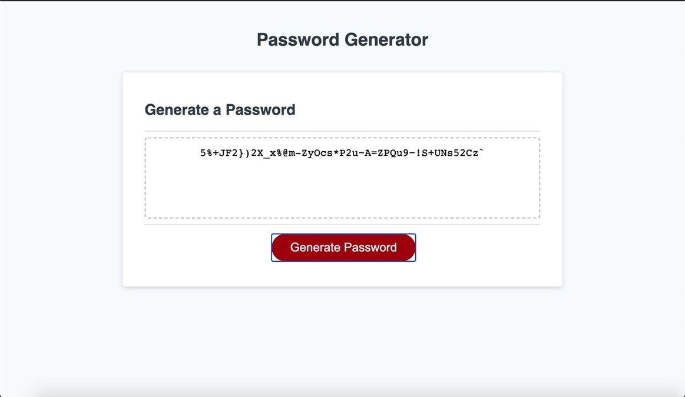

# Homwework-3
Project description:

In this project I created a password generator with certain specifications. User has options of what they want to include into a randomly generated password. User has four categories of options: Numbers, Lower case letters, Capital letters, and some special characters.
For this project I used Javascript:
1. Function Declaration
2. Variable Declaration
3. Conditional if statements
4. And a little bit of query Selectors.

Lessons learnt from the project:
1. How to not mislead yourself with global versus local variables. (Project took way longer than it had to because some variables were simply undefined in the global scope.)
2. How to generate random strings using predetermined input.
3. How to use window objects to interact with page and user experience.

What I would like to learn further:
1. How to create a similar project without using window pop-ups and solely DOM.
2. How to apply this project in other bigger projects that I am going to encounter in this class and future career.

You can find this project right here: https://github.com/Amal31497/Homework-3
The Deployed link is right here: https://amal31497.github.io/Homework-3/

Project Screenshots;

